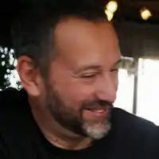

---
tags:
  - informazioni-generali
title: Davide Riboli Curriculum Vitæ
---

|                 |                                          |
| --------------- | ---------------------------------------- |
|  | Davide Riboli                            |
| Sito personale: | https://davideriboli.net                 |
| GitHub:         | https://github.com/davideriboli          |
| Instagram       | https://www.instagram.com/davide.riboli/ |
| Threads:        | https://www.threads.net/@davide.riboli   |
| X (Twitter):    | https://twitter.com/DavideRiboli         |
|                 |                                          |

## Esperienze in ambito accademico

- **Applicazioni Digitali per l’Arte** (in corso dal 2022)
  Cattedra di I Fascia presso l’Accademia di Belle Arti “Mario Sironi” di Sassari
- **Linguaggi multimediali** (dal 2015 al 2022)
  Insegnamento presso l’Accademia di Belle Arti di Urbino
- **Applicazioni Digitali per l’Arte** (dal 2013 al 2022)
  Insegnamento presso l’Accademia di Belle Arti di Urbino
- **Elementi di Informatica per il Design** (dal 2012 al 2022)
  Insegnamento presso l’ISIA di Urbino
- **Video Music** (dal 2011 al 2019)
   Insegnamento presso l’Accademia di Belle Arti di Urbino
- **Comunicazione Multimediale I e II** (dal 2010 al 2022)
  Insegnamento presso l’ISIA di Urbino (nel 2018, rinuncia a Comunicazione Multimediale II)
- **Elementi di Matematica per il Design** (dal 2008 al 2012)
  Insegnamento presso l’ISIA di Urbino
- **Laboratorio Multimediale** (dal 2003 al 2012)
  Insegnamento presso la Facoltà di Design e Arte dell’università IUAV di Venezia
- **Applicazioni digitali/Sistemi di elaborazione delle informazioni** (dal 2002 al 2014)
  Insegnamento presso la Facoltà di Design e Arte dell’università IUAV di Venezia

## Altro in ambito accademico

- Coordinamento [CODEX](https://codex.accademiasironi.it)/CREA (unità di ricerca per la Creatività Computazionale - ABA “Mario Sironi”, Sassari), a partire dal 2023.
- In seguito alla procedura di selezione per titoli - finalizzata alla costituzione di graduatorie nazionali, utili per l’attribuzione di incarichi a tempo indeterminato e determinato, per il personale docente delle istituzioni statali dell’alta formazione artistica, musicale e coreutica - comunicata attraverso Decreto Ministeriale n. 597/2018, pubblicato sul sito del MIUR in data 04.09.2018, Davide Riboli risulta incluso in detta graduatoria per quanto concerne l’insegnamento *ABTEC38 – Applicazioni Digitali*.
- In seguito alla procedura di selezione per titoli - finalizzata alla costituzione di graduatorie nazionali, utili per l’attribuzione di incarichi a tempo indeterminato e determinato, per il personale docente delle istituzioni statali dell’alta formazione artistica, musicale e coreutica - comunicata attraverso Decreto Ministeriale n. 645, pubblicato sul sito del MIUR in data 31/05/2021, Davide Riboli risulta incluso in detta graduatoria per quanto concerne l’insegnamento *ABTEC40 – Progettazione Multimediale*.
- Membro del *Consiglio Accademico ISIA Urbino* per il periodo 2011-2014.
- Membro del *Comitato Scientifico del Master di I Livello “Didattica e divulgazione della Matematica e delle Scienze”* – Università Carlo Bo di Urbino per il 2015.
- Lavori e tesi di studenti seguiti da Davide Riboli hanno vinto *diversi premi nazionali ed internazionali*, tra cui i prestigiosi “Premio Abbado” e “D&AD”. 
- Tra il 2014 e il 2016, insieme agli studenti Ardesia Coco, Leonardo Cuccia, Erica Esposito, Vanja Macovaz ed Elena Negri, Davide Riboli ha realizzato la *mappatura completa in realtà virtuale non immersiva del Monastero di Santa Chiara* in Urbino, attuale sede di ISIA Urbino. Il lavoro è ancora [visibile *online*](https://www.progetti-isiau.net/santachiara360/).

## Esperienze professionali in ambito digitale e multimediale

Davide Riboli ha collaborato alla realizzazione di: 

- Tamburo – CD-Rom interattivo e multimediale. Ideazione e contenuti di Lorenzo “Jovanotti” Cherubini, produzione SoleLuna. Un articolo in merito, pubblicato da “Repubblica” è ancora [disponibile in rete](https://ricerca.repubblica.it/repubblica/archivio/repubblica/1996/06/25/jovanotti-sull-isola-interattiva.html). 
- Inter in CD-Rom (box 2 dischi) – CD-Rom interattivo e multimediale sulla storia di FC Inter. Distribuzione internazionale curata da De Agostini Editore.
- Centinaia di siti siti web realizzati dagli studi Dolcini Associati (Pesaro) e Tassinari&Vetta (Trieste) tra la fine degli anni ‘90 e il primo decennio 2000.

## Conferenze, curatele, installazioni e mostre

### 2023

#### Ex Machina - Intelligenze Artificiali per l’Arte

Intervento sulle Intelligenze Artificiali Generative per l’Arte, tenuta al convegno “Intelligenza Artificiale tra Arte e Diritto” organizzata dal 13 al 15 dicembre 2023 presso l’Accademia di Belle Arti “Mario Sironi” di Sassari dai proff. Gian Luca Beccari e Antonio Salamone. Altri relatori: prof. Antonio Felice Uricchio, Presidente dell’Agenzia Nazionale di Valutazione dell’Università e della Ricerca (ANVUR), Maestro Paolo Troncon, direttore del Conservatorio di Conegliano Veneto (TV) e membro del Consiglio Nazionale per l'Alta Formazione Artistica e Musicale (CNAM), prof. Fabio dell’Aversana, docente di Legislazione dei Beni Culturali presso l’Accademia di Napoli, Presidente di SIEDAS ed esperto di studi della legislazione dell’arte e dello spettacolo, Stefano Giovanazzi, presidente dell’Archivio di Arte Contemporanea di Rovereto (TN) prof.ssa Marinella Cadoni, docente di Informatica dell’Università degli Studi di Sassari.

#### La Scuola del futuro, oggi

Tour di conferenza e seminari volto alla formazione di tutti i docenti di scuola superiore in Sardegna all’uso delle Intelligenze Artificiali in ambito didattico, organizzato grazie ai fondi PNRR 2023/24 dal Polo Formativo OnLife in compartecipazione con Istituto Pellegrini e Università degli Studi di Sassari .

#### Il Golem e Monna Lisa (col prof. Rossano Baronciani)

Intervento sulle Intelligenze Artificiali Generative per l’Arte, tenuto all’interno della rassegna “Sottotraccia” organizzata a Fermignano dalla Fondazione per l’Arte Contemporanea “Ex-Lanificio Carotti”. Con la partecipazione e il patrocinio del Comune di Fermignano, del Comune di Pesaro e del Comitato Pesaro Capitale della Cultura 2024.

### 2019

#### La ferita di Casanova 

Intervento alla conferenza intitolata Posso solo dire di aver vissuto - Vita e opera di Giacomo Casanova, tenutasi nell’ambito della manifestazione Caprile Illuminata, promossa dal Comune di Pesaro – Assessorato alla Bellezza, Fondazione G. Rossini, Ente Parco Naturale Monte San Bartolo, Provincia di Pesaro e Urbino, Regione Marche e AMAT. Relatori: proff. Davide Riboli e Marco Rocchi. Davide Riboli cura anche la realizzazione della installazione multimediale di accompagnamento. 

#### The Number Daemon 

Introduzione critica alle opere di arte digitale esposte dal Collettivo Urbino (Alesi, Brescia, Chiarucci), in esposizione alla galleria Bottega Bernardi di Urbino. 

### 2018
  
#### Arte e comunicazione, nel segno di Mario Perniola 

Conferenza organizzata dalla Accademia Vitruvio Fanum, nell’ambito delle manifestazioni correlate alla mostra itinerante Oltre il colore come tabù, organizzata a Fano dalla Galleria Enrico Astuni con i contributi dell’Assessorato alla Cultura del Comune di Fano e della Fondazione Cassa di Risparmio di Fano. 

### 2016

#### Musiche per fieri pasti 

Intervento al convegno Urbinoir, crimes for art’s sake sui rapporti tra musica, cinema e antropofagia. Organizzato da Comune di Urbino, Università di Urbino, Associazione Urbinoir. 

### 2014

#### Hibaku 

Videomapping sulla Rocca di Frontone. Supervisione e coordinamento dell’evento di apertura del festival di arte video e digitale OutOfRange.

#### Non Adornata Suite 

Video installazione, ospitata dai festival di arte video e digitale OutOfRange e XXXFuorifestival. 

#### 7 seconds 

Video installazione interattiva, ospitata dal festival di arte video e digitale XXXFuorifestival. 

#### Point of views 

Curatela artistica dell’omonima installazione multimediale di Martin Romeo presso la Sinagoga di Pesaro. 

### 2007

#### Pierre Klossowski e Le Baphomet - disegni inediti della collezione Carmelo Bene

Partecipazione all'organizzazione della mostra curata a Venezia da Angela Vettese per la Fondazione Bevilacqua La Masa.

### 1997

#### Katakripsi 

Installazione multimediale e interattiva realizzata insieme a Leonardo Sonnoli per conto dell’artista greco Dimitri Alithinos in occasione della Biennale di Venezia del 1997.

## ESPERIENZE ARTISTICHE 

### 2021

#### Marasma  

- Spettacolo di danza contemporanea  
- Regia e coreografia: Monica Miniucchi  
- Musiche originali, sound design e supervisione ai visual: Davide Riboli  
- Teatro della Chiesa della Maddalena, Pesaro

#### Una casa sul mare [Ulisse, Circe, Penelope - Omero, Dante Joice]  
  
- Concerto per voci recitanti e strumentazione digitale  
- Introduzione critica: Rossano Baronciani  
- Voce: Lucia Ferrati  
- Regia, voce e sound design: Davide Riboli  
- Produzione: ARGO (allestimento su commissione privata)

### 2020

#### In ~~Organic~~ Sex Appeal 

- Spettacolo liberamente tratto da «Il sex appeal dell’inorganico» di Mario Perniola  
- Sceneggiatura: Rossano Baronciani e Davide Riboli 
- Drammaturgia multimediale: Davide Riboli 
- Produzione: Accademia di Belle Arti di Urbino e TeatrOltre (*non allestito, causa disposizioni COVID-19*) 

### 2019

#### La cambiale di matrimonio 

- Opera lirica di Gioachino Rossini 
- Regia e interventi multimediali: Francesco Calcagnini e Davide Riboli  
- Produzione: Accademia di Belle Arti di Urbino, Conservatorio Rossini di Pesaro, Rossini Opera Festival 

#### Il campanello dello speziale 

- Opera lirica di Gaetano Donizetti 
- Regia e interventi multimediali: Francesco Calcagnini e Davide Riboli
- Produzione: Accademia di Belle Arti di Urbino, Teatro Lirico di Cagliari 

### 2018

#### Impreparati 

- Spettacolo liberamente tratto da «L’Affaire Moro» di Leonardo Sciascia
- Regia: Francesco Calcagnini 
- Sceneggiatura: Rossano Baronciani, Francesco Calcagnini, Davide Riboli
- Produzione: Accademia di Belle Arti di Urbino, 

### 2016  
  
#### Il barbiere di Siviglia 

- Opera lirica di Gioachino Rossini 
- Regia: Francesco Calcagnini 
- Interventi multimediali e videomapping: Davide Riboli 
- Produzione: Accademia di Belle Arti di Urbino, Rete Lirica delle Marche

### 2014
  
#### Il barbiere di Siviglia 

- Opera lirica di Gioachino Rossini 
- Regia: Francesco Calcagnini 
- Interventi multimediali e videomapping: Davide Riboli 
- Produzione: Accademia di Belle Arti di Urbino, Rossini Opera Festival 

### 2004

#### ‘l Mal de’ Fiori 

- Direzione artistica e interpretazione del concerto su testi di Carmelo Bene e musiche di Fernando Grillo 
- Evento speciale del Comune di Roma, presso la sala Pietro da Cortona in Campidoglio
- Produzione: Comune di Roma, Festival Esplorazioni, Fondazione Immemoriale di Carmelo Bene 

### 2002

#### Medea 

- Spettacolo liberamente tratto da testi di Apollonio Rodio ed Euripide
- Sceneggiatura, regia e drammaturgia multimediale: Davide Riboli
- Produzione: Machine de Théâtre, Teatro Capannone di Cortona

### 1989/90  

#### Biennale di Venezia Settore Teatro 

- Assistente personale del direttore artistico Carmelo Bene
- Responsabile del settore di ricerca nell’ambito delle nuove tecnologie digitali

### 1998 

#### Non adornata da alcun disegno 

- Soggetto, testo e regia: Davide Riboli 
- Musiche ed elaborazioni digitali: Marco Facondini, Davide Riboli
- Produzione: Compagnia Nostra Signora, Roma 

### 1985 al 1995

#### Assistente personale di Carmelo Bene 

- Collaborazione tecnica, artistica e registica a tutti gli spettacoli prodotti dalla compagnia Nostra Signora in questo periodo. Tra gli altri: *Hommelette for Hamlet*, *La Cena delle Beffe*, *Hamlet Suite* e *Achilleide*.

### 1988
  
#### Spettacolo Artaud 

- Spettacolo su testi di Antonin Artaud 
- Adattamento e regia: Davide Riboli 
- Produzione: Compagnia Nostra Signora, Roma 

### 1987

#### Ermione 

- Opera lirica di G. Rossini 
- Regia: Roberto De Simone 
- Assistente alla regia: Davide Riboli 
- Produzione: Rossini Opera Festival 

### 1985 

#### Suor Angelica 

- Opera lirica di Giacomo Puccini 
- Regia: Aldo Trionfo 
- Assistente alla regia: Davide Riboli 
- Produzione: Comune di Spoleto 

#### Ritratto di spalle/ La caduta 

- Testi: Rocco Mortellitti 
- Regia: Aldo Trionfo 
- Assistente alla regia: Davide Riboli 
- Produzione: Teatro dell’Orologio. Roma 

### 1984

#### Le due commedie in commedia 

- Testo di Giovanni Battista Andreini 
- Regia: Luca Ronconi 
- Musiche: Paolo Terni 
- Assistente alla scelta delle musiche: Davide Riboli
- Produzione: Biennale di Venezia, Settore Teatro

#### Le Comte Ory 

- Opera lirica di G. Rossini 
- Regia: Pier Luigi Pizzi 
- II Assistente alla regia: Davide Riboli 
- Produzione: Rossini Opera Festival 

#### Il viaggio a Reims 

- Opera lirica di G. Rossini 
- Regia: Luca Ronconi 
- II Assistente alla regia: Davide Riboli
- Produzione: Rossini Opera Festival